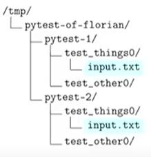

This readme is inspired by this [workshop](https://www.youtube.com/watch?v=ofPHJrAOaTE&t=2027s)

## Types of automated tests


## Pytest command helper flags:
#### general helper command flags:
- -v: stands for verbose output
    explanation: increase pytest's verbosity, [docs link](https://docs.pytest.org/en/8.3.x/how-to/output.html#verbosity)
- -x: exit instantly on the first failure
- --collect-only: only show which tests were collected
- --lf/--ff:</br>
    1] --lf, --last-failed - to only re-run the failures.</br>
    2] --ff, --failed-first - to run the failures first and then the rest of the tests.</br>
    [docs link](https://docs.pytest.org/en/stable/how-to/cache.html#how-to-re-run-failed-tests-and-maintain-state-between-test-runs)
- --tb: Control traceback generation
    this flag accepts one positional argument: \[long, short, line, and more...\]
    see argument option and more on [this link](https://docs.pytest.org/en/8.3.x/how-to/output.html#modifying-python-traceback-printing)
- -l: show local variables in tracebacks
- -s: disable stdout capturing, [docs link](https://docs.pytest.org/en/8.3.x/how-to/output.html#modifying-python-traceback-printing)
- -m: run test with specified mark only</br>
    example:
    ```shell
    pytest path/to/your/tests/ -m"webtest"
    ```
    more about -m flag in custom markers section

### commands helper flags related with fixtures:
- --fixtures: Show all defined fixutres with their docstrings
- --fixtures-per-test: Show the fixtures used, grouped by test
- --setup-show: Show fixtures as they are set up, used and torn down
- --setup-only: Only setup fixtures, do not execute tests
- --setup-plan: Show what fixtures/tests would be executed, but don't run anything
- --durations=n: will show the most n things that consume time within your test-suite.
    example: pytest path/to/your/tests/ --duration=5</br>
    explain: it will show the five most things that consume time in path/to/your/tests/ test-suite

#### Good practice: write a docsting for your fixtures 


## Pytest pytest.ini file settings:
### addopts: (stands for add options)
This settings can hold any number of the previous flags, and it will apply it automatically when testing(kind of presistent options throught the tests).</br>
[docs link](https://docs.pytest.org/en/stable/reference/reference.html#confval-addopts)
#### example:
in you pytest.ini file if addopts like this:</br>
addopts = -v</br>
this means when you are running: pytest path/to/test/unit</br>
you are doing this: pytest path/to/test/unit -v


## Asserting expected exceptions
full details on: [docs link](https://docs.pytest.org/en/stable/how-to/assert.html#matching-exception-messages)</br>
note: read more about match attribute within the context manager.

small example:
```python
def divide(x, y):
    return x / y

def test_raises():
    with pytest.raises(ZeroDivisionError):
        divide(3, 0)
```


## Custom Markers
Multiple custom markers can be registered, by defining each one in its own line, as shown in the below example.
```ini
# content of pytest.ini
[pytest]
markers =
    webtest: mark a test as a webtest.
    slow: mark test as slow.
```

You can ask which markers exist for your test suite:
```shell
$ pytest --markers
@pytest.mark.webtest: mark a test as a webtest.
@pytest.mark.slow: mark test as slow.
```

ok, what's all about, why to use markers?
we can do this:
```python
import pytest

@pytest.mark.webtest
def test_property_api():
    return ....
```

then in our terminal we can run tests that marked as webtest only, not the whole tests, like this:
```shell
pytest path/to/your/tests -m "webtest"
```

or if you want to disable tests to one of the marked tests, just do:
```shell
pytest path/to/your/tests -m "no webtest"
```

You can add -v to test command to show which tests are run


## Dealing with tests that cannot succeed with skipif and xfail
full details on: [docs link](https://docs.pytest.org/en/stable/how-to/skipping.html)</br>
You can mark test functions that cannot be run on certain platforms or that you expect to fail so pytest can deal with them accordingly and present a summary of the test session, while keeping the test suite green.

A skip means that you expect your test to pass only if some conditions are met, otherwise pytest should skip running the test altogether. Common examples are skipping windows-only tests on non-windows platforms, or skipping tests that depend on an external resource which is not available at the moment (for example a database).

An xfail means that you expect a test to fail for some reason. A common example is a test for a feature not yet implemented, or a bug not yet fixed. When a test passes despite being expected to fail (marked with pytest.mark.xfail), it’s an xpass and will be reported in the test summary.

```shell
pytest -rxXs  # show extra info on xfailed, xpassed, and skipped tests
```

### Skipping test functions
```python
@pytest.mark.skip(reason="no way of currently testing this")
def test_the_unknown(): ...
```

```python
@pytest.mark.skipif(sys.version_info < (3, 10), reason="requires python3.10 or higher")
def test_function(): ...
```

### XFail: mark test functions as expected to fail
```shell
@pytest.mark.xfail(sys.platform == "win32", reason="bug in a 3rd party library")
def test_function(): ...
```


## Parametrizing Tests
Parametrizing is type of markers


## Fixtures

A test fixtures:
- sets up objects or apps for testing
- provides test code with base app objects
- is very important to avoid repetitive test code

In pytest, fixtures realized as dependency injection:
- Fixture functions can create and return fixtures values
- Test functions and classes can request and use them.

general fixture example:
```python
@pytest.fixture
def faked_phone_number(db):
    return "+9639" + ''.join(str(random.randint(3, 6)) for i in range(8))
```
and here how to use it in test functions:
```python
def test_sign_up_as_client(client: APIClient, faked_client_sign_up_data: dict[str, Any]):
    ....
```

#### Skipping fixtures:
You can skip any fixture, as a result, all tests consume that fixture will be skipped also.</br>
example, after testing and marking fixture as skipped:</br>
```python
@pytest.fixture
def faked_phone_number(db):
    pytest.skip("Any Reason as message")
```
and the result on shell will be:
```shell
apps\Authentication\tests\apis\test_sign_up.py s                                                                                                                                [100%] 

================================================================================= 1 skipped in 7.47s =================================================================================
```

#### Using fixtures from fixtures:
example (learn by do):
```python
@pytest.fixture
def faked_phone_number():
    return "+9639" + ''.join(str(random.randint(3, 6)) for i in range(8))

@pytest.fixture
def faked_client_sign_up_data(faked_phone_number):
    pass # whatever testing logic
```

### Built-in Fixtures:
[docs link](https://docs.pytest.org/en/stable/reference/reference.html#fixtures)</br>
Usefull built-in fixtures
#### monkeypatch:
[docs link](https://docs.pytest.org/en/stable/reference/reference.html#pytest.monkeypatch.monkeypatch)</br>
allows to temporarily change the state for the <b>duration of a test function execution.</b></br>
In other words, if you want to change something inside test unit and never update it throught all the tests, use monkeypatch fixture

example (not with this example, add -s when running the test):</br>
```python
import getpass

def validate_password():
    return getpass.getpass() == "super-secure"

def test_validate_password_good(monkeypatch: pytest.MonkeyPatch):
    monkeypatch.setattr(getpass, "getpass", lambda: "super-secure")
    assert validate_password()

def test_validate_password_bad(monkeypatch):
    monkeypatch.setattr(getpass, "getpass", lambda: "in-secure")
    assert not validate_password()

```
and thats what happened during calling tests:


#### tmp_path:
[tmp_path docs link](https://docs.pytest.org/en/stable/reference/reference.html#tmp-path)</br>
[how to use temporary directories and files in tests via tmp_path?](https://docs.pytest.org/en/stable/how-to/tmp_path.html#how-to-use-temporary-directories-and-files-in-tests)

Return a temporary directory path object which is unique to each test function invocation, created as a sub directory of the base temporary directory.</br>
The returned object is a pathlib.Path object.</br>

##### Additional info about tmp_path from docs:</br>
What's happening when using tmp_path?</br>
By default, a new base temporary directory is created each test session, and old bases are removed after 3 sessions, to aid in debugging.

example:
```python
from pathlib import Path

@pytest.fixture
def input_file(tmp_path: Path) -> Path:
    path = tmp_path / "input.txt"
    path.write_text("Hello, World!")

    return path

def test_things(input_file: Path):
    text = input_file.read_text()
    assert text == "Hello, World!"
```
What happen if we call this test twice?
we will get this kind of directroy structure here:</br>


### Caching fixtures results:
example (learn by example):
```py
@pytest.fixture(scope="function")
def answers():
    time.sleep(2)
    return [42]

def test_one(answers)
    assert answers == [42]

def test_two(answers)
    assert answers == [42]
```
If we stay on function scope, the fixture will be called once for each test function.</br>
But, if make it module scope, the fixture result will be cached for each module which will save processing time.</br>
</br>
However, this can be some kind of dangerous because when editing any fixture shared between module it will be edited throught the module.</br>
Example:
```py
@pytest.fixture(scope="module")
def answers():
    return [42]

def test_one(answers)
    answers.append(44)
    assert answers == [42, 44]

def test_two(answers)
    assert answers == [42]
```
Explain: in the previous case, the second test will fail because answers (which is cached) now are [42, 44] not just [42].</br>
So, be careful</br>
`originaly` there are five fixture scopes supported by pytest:
1. "function" (default)
2. "class" (means: every class will get it's own value, but tests inside the class will share it)
3. "module" (means: the value will be shared in the same file)
4. "package" (means: revise documentation)
5. "session" (means: share the value for entire test session for all tests)

### Yielding fixtures:
Why to yield fixtures?</br>

Using yield in fixtures doesn't directly enhance performance in terms of execution speed. Instead, it focuses on managing resource usage more efficiently. Here's how:

1. Efficient Resource Management: By using yield to handle setup and teardown in a fixture, you ensure resources are allocated only for the duration of the test and then properly released afterward. This can indirectly improve performance by avoiding resource leaks, which could slow down the system or cause issues when tests are run repeatedly.

2. Lazy Resource Initialization: yield allows for lazy initialization, meaning the resource setup happens only when the test is run. This can prevent unnecessary resource allocation if a fixture is defined but not used in some tests.

3. Isolated Teardown: Having teardown code run immediately after a test (using yield) ensures that resources are cleaned up as soon as they're no longer needed. This helps keep memory and other resources free, especially in large test suites where many fixtures are used.</br>

Example:
```py
class Client:
    def connect(self):
        print("connected")
    def diconnect(self):
        print("disconnected")

@pytest.fixture
def connected_client():
    client = Client()
    client.connect()
    yield client
    client.diconnect()

def test_client(connected_client):
    print("in the test")
    assert False
```
Then run test with --setup-show flag to see fixture built and teardown process.


### Share fixtures between different test files
Let's put some rule:
1. Fixtures defined as methods of a test class are available only to test methods on that class
2. Fixtures defined in a test moudle are available only to tests in that module
3. Fixtures defined in a conftest.py file are available to tests in the directory and subdirectory.</br>

`Note`: Fixtures don't get imported, pytest autodiscovers them!

### Autouse fixtures:

